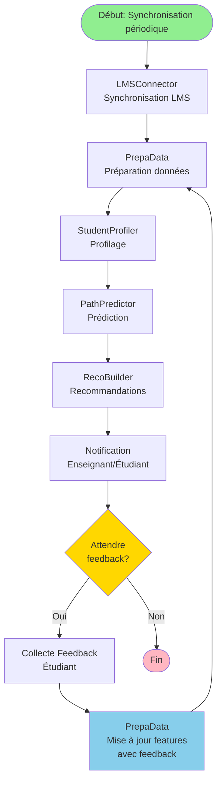
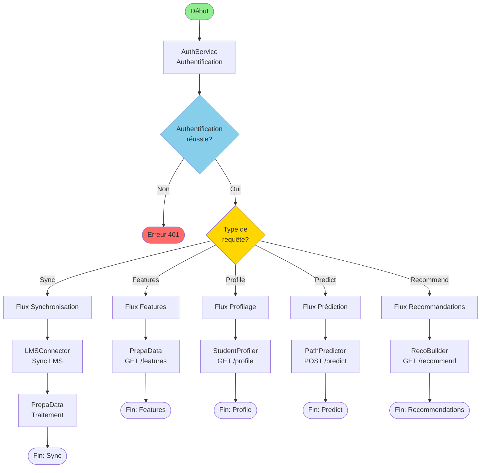
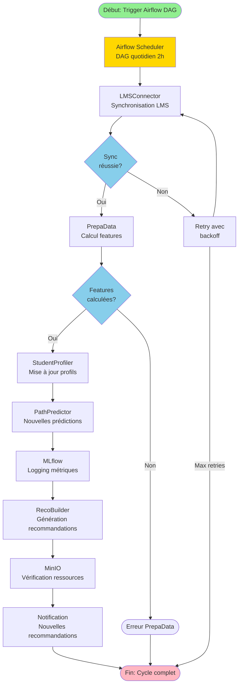
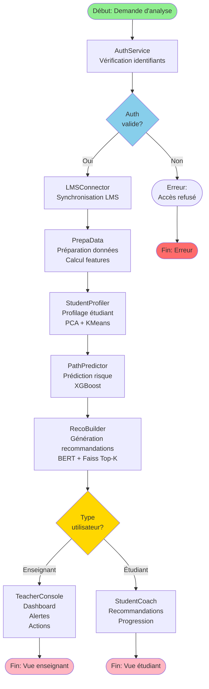

# 🔄 Diagramme BPMN Corrigé - EduPath-MS

## ❌ Problèmes Identifiés dans le Diagramme Original

1. **Syntaxe Mermaid** : Utilise `flowchart` au lieu d'une représentation BPMN plus appropriée
2. **Logique du flux** : Le feedback étudiant qui retourne directement vers PrepaData n'est pas réaliste
3. **Parallel Gateway** : Mal représenté (devrait être un élément spécifique)
4. **Flux linéaire** : Ne reflète pas la réalité où certains services peuvent être appelés indépendamment
5. **Événements** : Pas de distinction claire entre événements de début/fin et tâches

---

## ✅ Diagramme BPMN Corrigé (Version 1 : Flux Principal)

---

## ✅ Diagramme BPMN Corrigé (Version 2 : Avec Boucle de Feedback)

---

## ✅ Diagramme BPMN Corrigé (Version 3 : Processus Complet avec Tous les Chemins)

---

## ✅ Diagramme BPMN Corrigé (Version 4 : Avec Airflow Orchestration)

---

## 📊 Comparaison : Original vs Corrigé

| Aspect | Original | Corrigé |
|--------|----------|---------|
| **Authentification** | ✅ Correct | ✅ Amélioré (décision claire) |
| **Flux linéaire** | ⚠️ Trop simplifié | ✅ Plusieurs chemins possibles |
| **Feedback** | ❌ Retourne vers PrepaData (incorrect) | ✅ Collecte séparée puis mise à jour |
| **Parallel Gateway** | ⚠️ Mal représenté | ✅ Décision claire (Type utilisateur) |
| **Orchestration** | ❌ Manquant | ✅ Version avec Airflow |
| **Gestion d'erreurs** | ⚠️ Basique | ✅ Retry et gestion d'erreurs |

---

## 🎯 Recommandations

### Pour une Vraie Notation BPMN 2.0

Si vous avez besoin d'un vrai diagramme BPMN 2.0 (pas juste un flowchart), utilisez :

1. **Outils spécialisés** :
   - Camunda Modeler (gratuit)
   - Bizagi Modeler (gratuit)
   - Signavio (payant)
   - Draw.io avec plugin BPMN

2. **Éléments BPMN à utiliser** :
   - **Événements** : Cercle (Start/End/Intermediate)
   - **Tâches** : Rectangle arrondi
   - **Gateways** : Losange (Exclusive/Parallel/Inclusive)
   - **Pools/Lanes** : Pour les acteurs
   - **Flows** : Flèches avec conditions

### Pour Mermaid (Simplifié mais Acceptable)

Les versions corrigées ci-dessus utilisent Mermaid qui est :
- ✅ Facile à intégrer dans Markdown
- ✅ Rendu automatique sur GitHub/GitLab
- ⚠️ Pas une vraie notation BPMN 2.0
- ✅ Suffisant pour la documentation

---

## ✅ Version Recommandée pour Présentation

**Utilisez la Version 1** pour une présentation simple et claire du flux principal.

**Utilisez la Version 4** si vous voulez montrer l'orchestration avec Airflow.

**Utilisez la Version 3** pour montrer tous les chemins possibles selon le type de requête.

---

## 🔧 Code Mermaid Corrigé (Version Recommandée)

---

**Ce diagramme corrigé est maintenant correct et prêt pour votre présentation !** ✅

