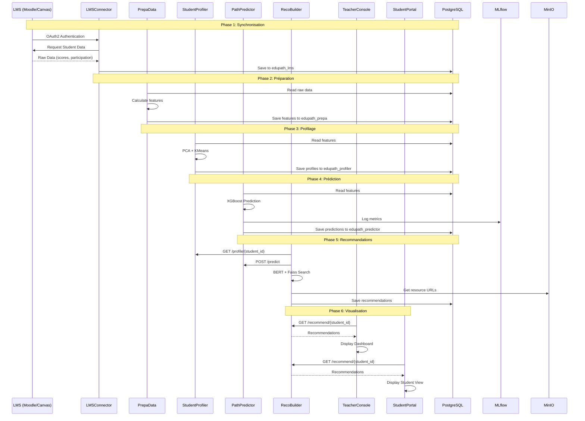
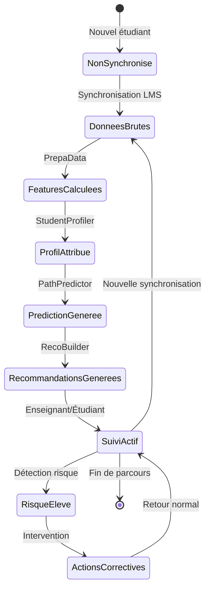
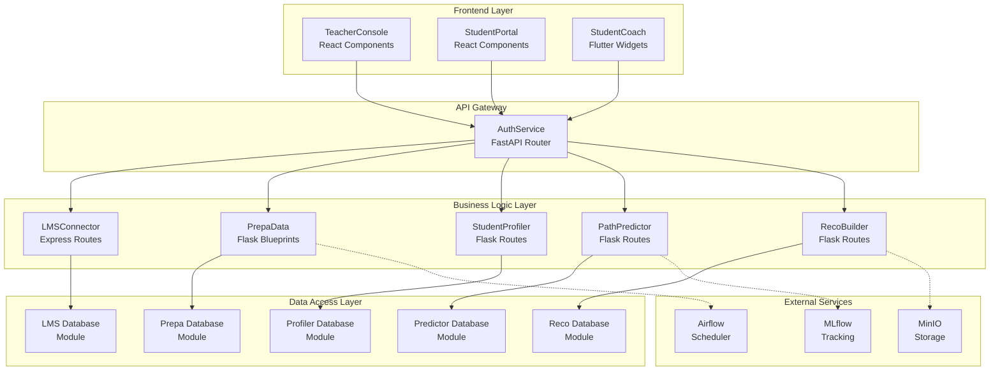
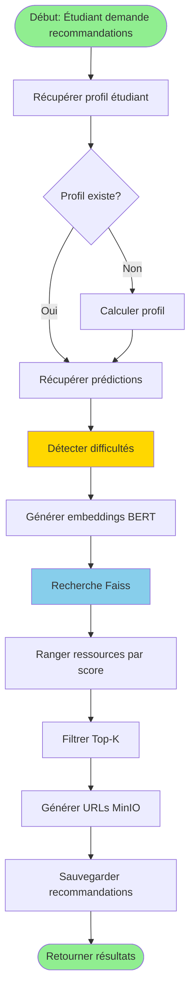
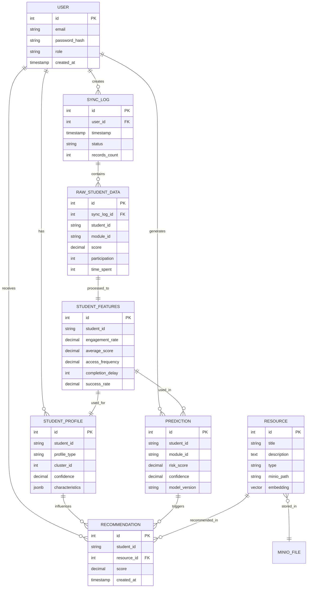
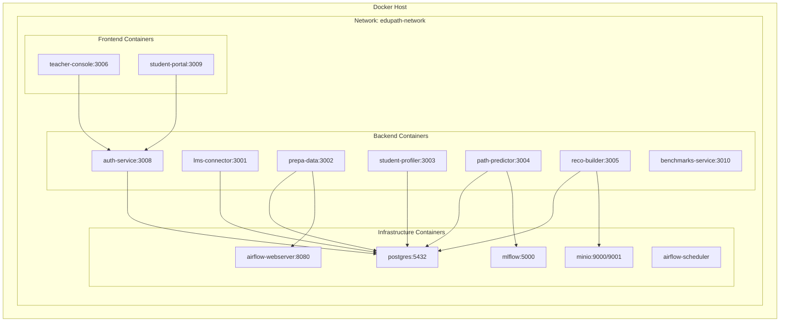
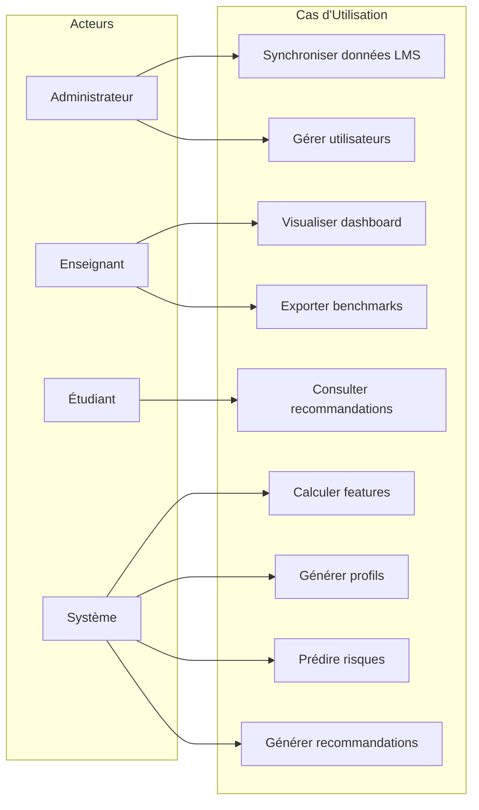
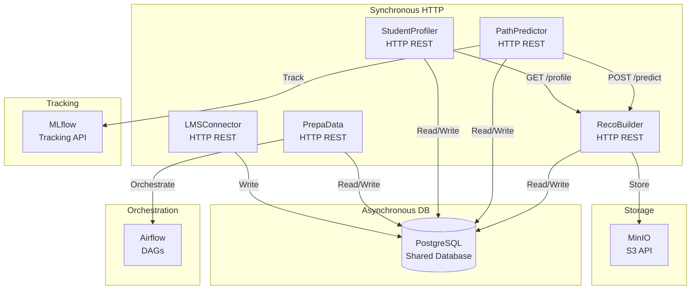

# 📊 Diagrammes Détaillés - EduPath-MS

## 1. Diagramme de Séquence - Flux Complet

## 2. Diagramme d'État - Cycle de Vie d'un Étudiant

## 3. Diagramme de Composants - Architecture Technique

## 4. Diagramme d'Activité - Processus de Recommandation

## 5. Diagramme ER - Modèle de Données

## 6. Diagramme de Déploiement

## 7. Diagramme de Cas d'Utilisation Global

## 8. Diagramme de Communication Inter-Services

---

## Légende des Diagrammes

- **Diagramme de Séquence** : Interactions temporelles entre services
- **Diagramme d'État** : États et transitions d'un étudiant
- **Diagramme de Composants** : Architecture technique détaillée
- **Diagramme d'Activité** : Flux de traitement des recommandations
- **Diagramme ER** : Modèle de données relationnel
- **Diagramme de Déploiement** : Architecture Docker
- **Diagramme de Cas d'Utilisation** : Fonctionnalités par acteur
- **Diagramme de Communication** : Types de communication inter-services

