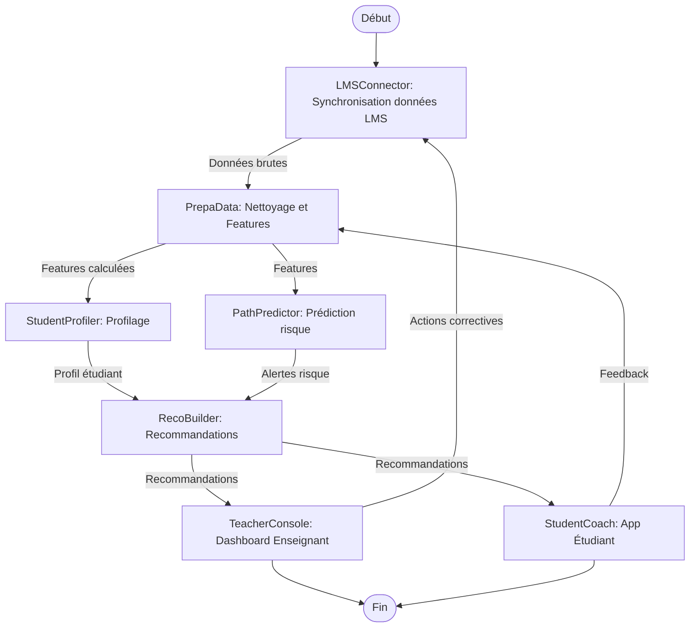
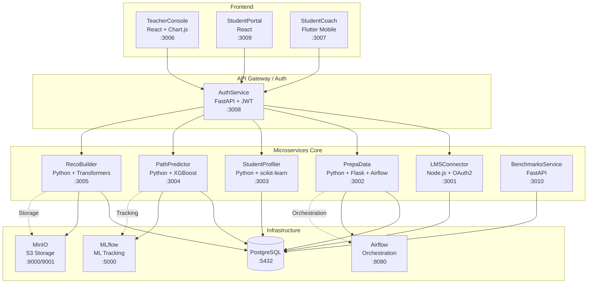
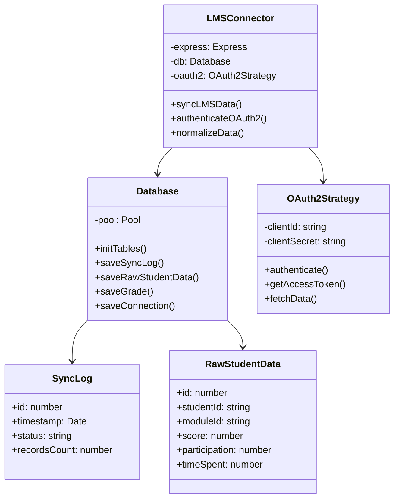
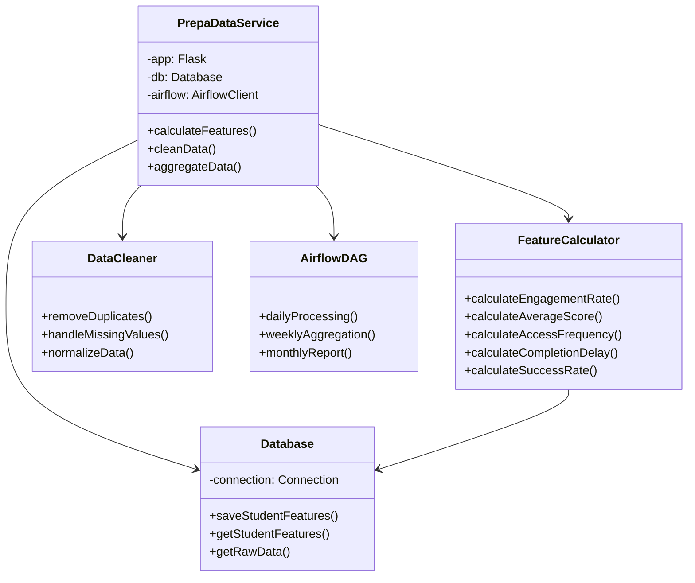
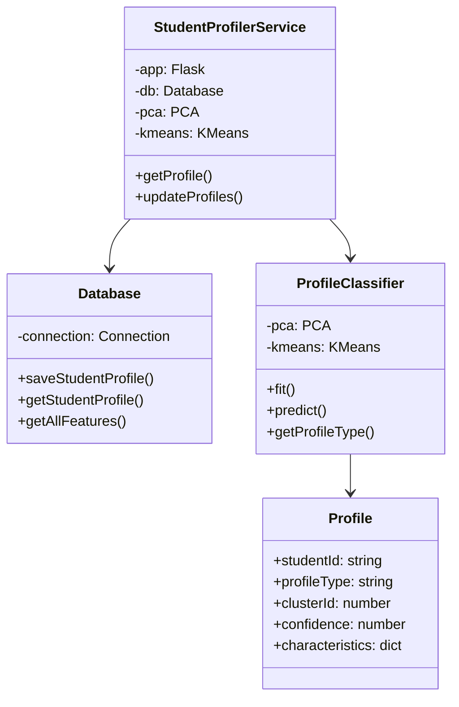
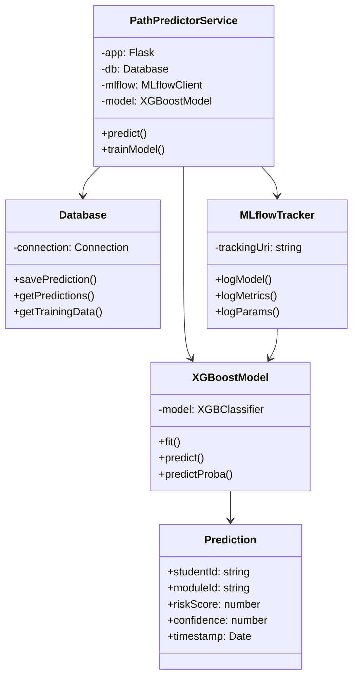
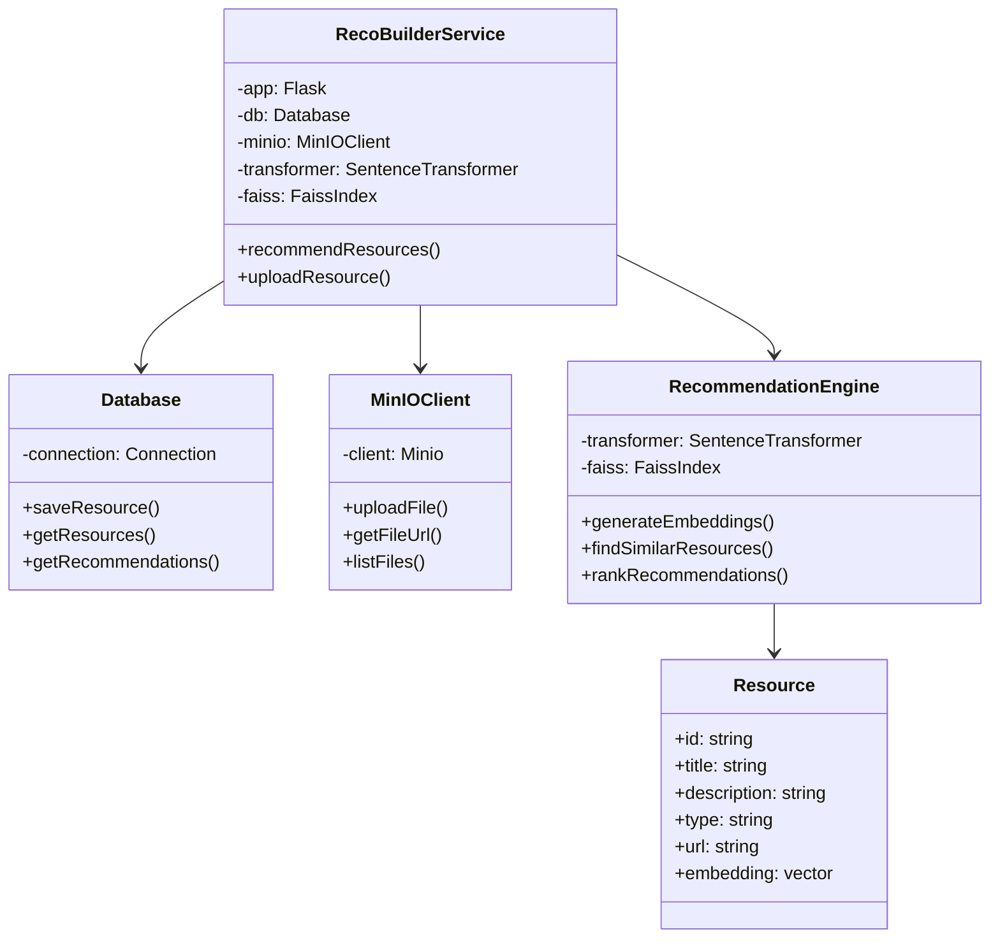
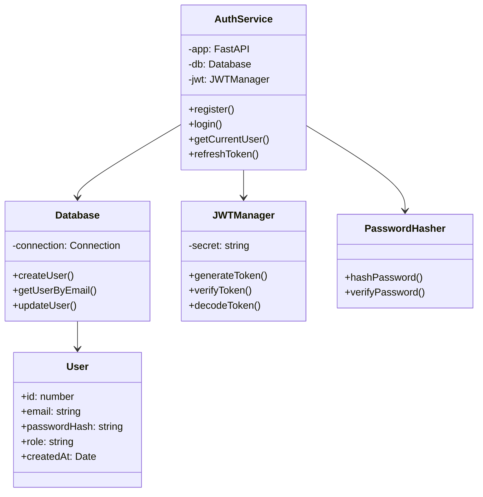

# 📚 Documentation Complète - EduPath-MS

## Table des Matières

1. [Diagramme BPMN - Processus Métiers](#1-diagramme-bpmn---processus-métiers)
2. [Architecture Microservices](#2-architecture-microservices)
3. [Conception des Microservices](#3-conception-des-microservices)
4. [Maquettes UI/UX](#4-maquettes-uiux)

---

## 1. Diagramme BPMN - Processus Métiers

### 1.1 Processus Principal : Analyse et Recommandation



### 1.2 Description Détaillée des Processus

#### **Processus 1 : Synchronisation des Données (LMSConnector)**

**Acteurs** : Système LMS (Moodle/Canvas), LMSConnector

**Étapes** :
1. **Connexion OAuth2** : Authentification sécurisée avec le LMS
2. **Extraction des données** : Récupération des notes, participations, temps passé
3. **Normalisation** : Conversion au format standard EduPath
4. **Stockage PostgreSQL** : Sauvegarde dans `edupath_lms`
5. **Log de synchronisation** : Enregistrement de l'opération

**Décisions** :
- Si OAuth2 échoue → Retry avec backoff exponentiel
- Si données invalides → Log d'erreur, notification admin

**Résultat** : Données brutes normalisées disponibles pour traitement

---

#### **Processus 2 : Préparation des Données (PrepaData)**

**Acteurs** : PrepaData, Airflow (orchestration)

**Étapes** :
1. **Chargement des données brutes** : Depuis PostgreSQL `edupath_lms`
2. **Nettoyage** : Suppression des doublons, valeurs manquantes
3. **Calcul des features** :
   - Taux d'engagement (sessions / temps total)
   - Score moyen pondéré
   - Fréquence d'accès
   - Délai moyen de complétion
   - Taux de réussite par module
4. **Agrégation temporelle** : Calculs par semaine/mois
5. **Stockage** : Sauvegarde dans PostgreSQL `edupath_prepa`

**Orchestration Airflow** :
- DAG quotidien à 2h du matin
- DAG hebdomadaire pour agrégations
- DAG mensuel pour rapports

**Résultat** : Features normalisées prêtes pour ML

---

#### **Processus 3 : Profilage des Étudiants (StudentProfiler)**

**Acteurs** : StudentProfiler, PrepaData

**Étapes** :
1. **Chargement des features** : Depuis `edupath_prepa`
2. **Réduction de dimensionnalité** : PCA (Principal Component Analysis)
3. **Clustering** : KMeans pour identifier profils types
4. **Classification** : Attribution d'un profil à chaque étudiant
5. **Stockage** : Profil sauvegardé dans PostgreSQL `edupath_profiler`

**Profils détectés** :
- **Assidu** : Engagement élevé, scores élevés
- **Procrastinateur** : Délais longs, dernière minute
- **En difficulté** : Scores faibles, faible engagement
- **Irregular** : Engagement variable

**Résultat** : Profil attribué à chaque étudiant

---

#### **Processus 4 : Prédiction de Risque (PathPredictor)**

**Acteurs** : PathPredictor, MLflow (tracking)

**Étapes** :
1. **Chargement historique** : Features + résultats passés
2. **Entraînement modèle** : XGBoost avec validation croisée
3. **Tracking MLflow** : Métriques, paramètres, artefacts
4. **Prédiction** : Probabilité d'échec par module
5. **Stockage** : Prédictions dans PostgreSQL `edupath_predictor`

**Modèle ML** :
- **Algorithme** : XGBoost Classifier
- **Features** : Engagement, scores, délais, historique
- **Target** : Échec (0/1) ou Score final (< 10/10)

**Alertes générées** :
- Risque élevé (> 70%) → Alerte urgente
- Risque moyen (40-70%) → Alerte préventive
- Risque faible (< 40%) → Suivi normal

**Résultat** : Prédictions de risque avec métriques MLflow

---

#### **Processus 5 : Génération de Recommandations (RecoBuilder)**

**Acteurs** : RecoBuilder, MinIO (stockage), Transformers

**Étapes** :
1. **Analyse du profil** : Récupération profil + prédictions
2. **Détection des difficultés** : Modules à risque, faiblesses
3. **Recherche de similarité** : BERT embeddings + Faiss
4. **Sélection ressources** : Top-K ressources pertinentes
5. **Stockage MinIO** : Fichiers multimédias (vidéos, PDFs)
6. **Génération recommandations** : Liste personnalisée

**Technologies** :
- **Embeddings** : sentence-transformers (BERT)
- **Similarité** : Faiss (Facebook AI Similarity Search)
- **Stockage** : MinIO (S3-compatible)

**Types de recommandations** :
- Ressources vidéo (tutoriels)
- Exercices pratiques
- Documentation complémentaire
- Sessions de tutorat

**Résultat** : Recommandations personnalisées avec liens vers ressources

---

#### **Processus 6 : Visualisation Enseignant (TeacherConsole)**

**Acteurs** : Enseignant, TeacherConsole

**Étapes** :
1. **Authentification** : JWT via AuthService
2. **Chargement données** : Profils, prédictions, alertes
3. **Visualisation** :
   - Dashboard global (graphiques Chart.js)
   - Liste étudiants à risque
   - Clustering par profil
   - Statistiques par module
4. **Actions** : Envoi messages, planification tutorat

**Résultat** : Vue d'ensemble pour prise de décision

---

#### **Processus 7 : Interface Étudiant (StudentCoach)**

**Acteurs** : Étudiant, StudentCoach (Mobile)

**Étapes** :
1. **Authentification** : JWT via AuthService
2. **Chargement données** : Progression, recommandations
3. **Affichage** :
   - Progression personnelle
   - Recommandations reçues
   - Alertes et conseils
4. **Feedback** : Évaluation des recommandations

**Résultat** : Accompagnement personnalisé étudiant

---

## 2. Architecture Microservices

### 2.1 Schéma Vue d'Ensemble



### 2.2 Rôle de Chaque Microservice

| Microservice | Rôle Principal | Responsabilité |
|--------------|----------------|----------------|
| **LMSConnector** | Synchronisation | Extraction et normalisation des données depuis Moodle/Canvas via OAuth2 |
| **PrepaData** | Préparation | Nettoyage, normalisation, calcul de features avec orchestration Airflow |
| **StudentProfiler** | Profilage | Clustering des étudiants par profil (KMeans/PCA) |
| **PathPredictor** | Prédiction | Prédiction du risque d'échec avec XGBoost et tracking MLflow |
| **RecoBuilder** | Recommandations | Génération de recommandations personnalisées avec BERT + Faiss |
| **AuthService** | Authentification | Gestion des utilisateurs, JWT, autorisations |
| **TeacherConsole** | Interface Enseignant | Dashboard React avec visualisations Chart.js |
| **StudentPortal** | Interface Étudiant Web | Portail web React pour étudiants |
| **StudentCoach API** | API Mobile | Backend FastAPI pour application Flutter |
| **BenchmarksService** | Benchmarks | Génération de données anonymisées pour recherche |

### 2.3 Technologies Utilisées

| Microservice | Stack Technique | Bibliothèques Clés |
|--------------|-----------------|---------------------|
| **LMSConnector** | Node.js + Express | `passport-oauth2`, `pg`, `express-session` |
| **PrepaData** | Python + Flask | `pandas`, `numpy`, `apache-airflow`, `psycopg2` |
| **StudentProfiler** | Python + Flask | `scikit-learn`, `numpy`, `pandas`, `psycopg2` |
| **PathPredictor** | Python + Flask | `xgboost`, `scikit-learn`, `mlflow`, `psycopg2` |
| **RecoBuilder** | Python + Flask | `sentence-transformers`, `faiss-cpu`, `torch`, `minio` |
| **AuthService** | Python + FastAPI | `jwt`, `bcrypt`, `psycopg2`, `pydantic` |
| **TeacherConsole** | React + Vite | `react-router`, `chart.js`, `axios` |
| **StudentPortal** | React + Vite | `react-router`, `axios` |
| **StudentCoach API** | Python + FastAPI | `fastapi`, `uvicorn`, `psycopg2` |
| **BenchmarksService** | Python + FastAPI | `fastapi`, `pandas`, `psycopg2` |

### 2.4 Bases de Données Associées

| Microservice | Base de Données | Tables Principales |
|--------------|-----------------|-------------------|
| **LMSConnector** | `edupath_lms` | `sync_logs`, `raw_student_data`, `grades`, `connections` |
| **PrepaData** | `edupath_prepa` | `student_features`, `aggregated_data` |
| **StudentProfiler** | `edupath_profiler` | `student_profiles`, `clusters` |
| **PathPredictor** | `edupath_predictor` | `predictions`, `model_versions` |
| **RecoBuilder** | `edupath_reco` | `resources`, `recommendations`, `resource_metadata` |
| **AuthService** | `edupath_auth` | `users`, `sessions`, `tokens` |
| **StudentCoach API** | `edupath_student` | `student_progress`, `feedback` |
| **BenchmarksService** | `edupath_benchmarks` | `anonymized_data`, `benchmarks` |
| **MLflow** | `mlflow_db` | Tables MLflow (runs, experiments, models) |
| **Airflow** | `airflow_db` | Tables Airflow (dags, tasks, logs) |

### 2.5 Méthodes de Communication

| Communication | Type | Outil | Description |
|---------------|------|-------|-------------|
| **Frontend ↔ AuthService** | Synchrone | HTTP REST | Authentification JWT |
| **Frontend ↔ Microservices** | Synchrone | HTTP REST | Appels API directs |
| **LMSConnector → PrepaData** | Asynchrone | PostgreSQL | Écriture dans DB, lecture par PrepaData |
| **PrepaData → StudentProfiler** | Asynchrone | PostgreSQL | Features disponibles dans DB |
| **PrepaData → PathPredictor** | Asynchrone | PostgreSQL | Features disponibles dans DB |
| **StudentProfiler → RecoBuilder** | Synchrone | HTTP REST | GET `/profile/{student_id}` |
| **PathPredictor → RecoBuilder** | Synchrone | HTTP REST | GET `/predict?student_id=X&module_id=Y` |
| **PathPredictor → MLflow** | Synchrone | HTTP REST | Tracking des modèles ML |
| **PrepaData → Airflow** | Orchestration | Airflow DAGs | Planification des tâches |
| **RecoBuilder → MinIO** | Synchrone | S3 API | Stockage fichiers multimédias |

**Légende** :
- **Synchrone** : Requête-réponse immédiate (HTTP REST)
- **Asynchrone** : Communication via base de données (PostgreSQL)
- **Orchestration** : Planification via Airflow DAGs

---

## 3. Conception des Microservices

### 3.1 LMSConnector

#### Diagramme de Classes



#### Cas d'Utilisation

**UC-1 : Synchronisation des Données LMS**

- **Acteur** : Système externe (cron job) ou Admin
- **Préconditions** : OAuth2 configuré, LMS accessible
- **Scénario principal** :
  1. Appel GET `/sync`
  2. Authentification OAuth2
  3. Extraction des données depuis LMS
  4. Normalisation des données
  5. Sauvegarde dans PostgreSQL
  6. Retour du nombre de records synchronisés
- **Scénario alternatif** : Échec OAuth2 → Retry avec backoff
- **Postconditions** : Données disponibles dans `edupath_lms`

**UC-2 : Authentification OAuth2**

- **Acteur** : LMSConnector
- **Préconditions** : Credentials OAuth2 configurés
- **Scénario principal** :
  1. Redirection vers LMS pour authentification
  2. Callback avec code d'autorisation
  3. Échange code contre access token
  4. Stockage du token
- **Postconditions** : Token disponible pour requêtes API

---

### 3.2 PrepaData

#### Diagramme de Classes



#### Cas d'Utilisation

**UC-1 : Calcul des Features d'un Étudiant**

- **Acteur** : StudentProfiler ou PathPredictor
- **Préconditions** : Données brutes disponibles dans `edupath_lms`
- **Scénario principal** :
  1. Appel GET `/features/{student_id}`
  2. Chargement données brutes depuis DB
  3. Nettoyage des données
  4. Calcul des features (engagement, scores, délais)
  5. Sauvegarde dans `edupath_prepa`
  6. Retour des features calculées
- **Postconditions** : Features disponibles pour ML

**UC-2 : Orchestration Airflow**

- **Acteur** : Airflow Scheduler
- **Préconditions** : DAG configuré
- **Scénario principal** :
  1. Déclenchement DAG quotidien (2h)
  2. Exécution tâche de traitement
  3. Calcul features pour tous étudiants
  4. Agrégation hebdomadaire/mensuelle
- **Postconditions** : Données à jour

---

### 3.3 StudentProfiler

#### Diagramme de Classes



#### Cas d'Utilisation

**UC-1 : Obtenir le Profil d'un Étudiant**

- **Acteur** : RecoBuilder ou TeacherConsole
- **Préconditions** : Features calculées disponibles
- **Scénario principal** :
  1. Appel GET `/profile/{student_id}`
  2. Chargement features depuis `edupath_prepa`
  3. Application PCA (réduction dimensionnalité)
  4. Classification KMeans
  5. Attribution profil (Assidu, Procrastinateur, etc.)
  6. Sauvegarde dans `edupath_profiler`
  7. Retour du profil
- **Postconditions** : Profil disponible pour recommandations

---

### 3.4 PathPredictor

#### Diagramme de Classes



#### Cas d'Utilisation

**UC-1 : Prédire le Risque d'Échec**

- **Acteur** : RecoBuilder ou TeacherConsole
- **Préconditions** : Modèle entraîné, features disponibles
- **Scénario principal** :
  1. Appel POST `/predict` avec `student_id` et `module_id`
  2. Chargement features depuis `edupath_prepa`
  3. Application modèle XGBoost
  4. Calcul probabilité d'échec
  5. Sauvegarde prédiction dans `edupath_predictor`
  6. Logging MLflow (métriques)
  7. Retour de la prédiction
- **Postconditions** : Prédiction disponible pour alertes

**UC-2 : Entraînement du Modèle**

- **Acteur** : Admin ou job automatique
- **Préconditions** : Données historiques suffisantes
- **Scénario principal** :
  1. Chargement données d'entraînement
  2. Préparation features + labels
  3. Validation croisée
  4. Entraînement XGBoost
  5. Évaluation métriques (accuracy, precision, recall)
  6. Enregistrement dans MLflow
  7. Sauvegarde modèle
- **Postconditions** : Nouveau modèle disponible

---

### 3.5 RecoBuilder

#### Diagramme de Classes



#### Cas d'Utilisation

**UC-1 : Générer des Recommandations**

- **Acteur** : StudentPortal ou StudentCoach
- **Préconditions** : Profil et prédictions disponibles
- **Scénario principal** :
  1. Appel GET `/recommend/{student_id}`
  2. Récupération profil (StudentProfiler)
  3. Récupération prédictions (PathPredictor)
  4. Détection difficultés (modules à risque)
  5. Génération embeddings BERT pour difficultés
  6. Recherche similarité Faiss dans ressources
  7. Sélection Top-K ressources
  8. Génération URLs MinIO
  9. Retour liste recommandations
- **Postconditions** : Recommandations disponibles pour étudiant

**UC-2 : Upload de Ressource**

- **Acteur** : Admin
- **Préconditions** : Fichier valide, MinIO accessible
- **Scénario principal** :
  1. Upload fichier (vidéo, PDF, etc.)
  2. Upload vers MinIO
  3. Génération embedding BERT
  4. Indexation dans Faiss
  5. Sauvegarde métadonnées dans DB
- **Postconditions** : Ressource disponible pour recommandations

---

### 3.6 AuthService

#### Diagramme de Classes



#### Cas d'Utilisation

**UC-1 : Connexion Utilisateur**

- **Acteur** : Frontend (TeacherConsole, StudentPortal)
- **Préconditions** : Utilisateur existe
- **Scénario principal** :
  1. POST `/auth/login` avec email/password
  2. Vérification email dans DB
  3. Vérification password (bcrypt)
  4. Génération JWT token
  5. Retour token + user info
- **Scénario alternatif** : Credentials invalides → 401
- **Postconditions** : Token disponible pour requêtes authentifiées

**UC-2 : Inscription Utilisateur**

- **Acteur** : Nouvel utilisateur
- **Préconditions** : Email unique
- **Scénario principal** :
  1. POST `/auth/register` avec email/password/role
  2. Vérification email unique
  3. Hash password (bcrypt)
  4. Création utilisateur dans DB
  5. Génération JWT token
  6. Retour token + user info
- **Scénario alternatif** : Email existe → 409 Conflict

---

## 4. Maquettes UI/UX

### 4.1 TeacherConsole (Dashboard Enseignant)

**Figma** : [Lien vers maquette Figma - TeacherConsole](https://www.figma.com/design/edupath-teacher-console)

**Pages principales** :

1. **Page de Connexion**
   - Formulaire email/password
   - Design moderne avec logo EduPath
   - Validation en temps réel

2. **Dashboard Principal**
   - **Vue d'ensemble** :
     - Graphique : Nombre d'étudiants par profil (Chart.js Pie)
     - Graphique : Évolution des scores moyens (Chart.js Line)
     - Graphique : Distribution des risques (Chart.js Bar)
   - **Alertes** :
     - Liste étudiants à risque élevé
     - Notifications en temps réel
   - **Statistiques** :
     - Taux de réussite global
     - Modules les plus difficiles

3. **Page Détail Étudiant**
   - Profil complet
   - Historique des scores
   - Prédictions de risque
   - Recommandations envoyées
   - Actions : Message, Tutorat

4. **Page Clustering**
   - Visualisation des clusters (Chart.js Scatter)
   - Liste étudiants par profil
   - Filtres par profil

5. **Page Modules**
   - Liste des modules
   - Statistiques par module
   - Étudiants en difficulté par module

**Composants UI** :
- Header avec navigation
- Sidebar avec menu
- Cards pour statistiques
- Tables avec pagination
- Modals pour actions

---

### 4.2 StudentPortal (Portail Étudiant)

**Figma** : [Lien vers maquette Figma - StudentPortal](https://www.figma.com/design/edupath-student-portal)

**Pages principales** :

1. **Page de Connexion**
   - Formulaire email/password
   - Lien "Créer un compte"
   - Design étudiant-friendly

2. **Dashboard Étudiant**
   - **Progression** :
     - Graphique : Évolution des scores (Chart.js Line)
     - Graphique : Temps passé par module (Chart.js Bar)
   - **Recommandations** :
     - Liste ressources recommandées
     - Cards avec preview
     - Boutons d'action (Voir, Marquer comme lu)
   - **Alertes** :
     - Notifications personnalisées
     - Conseils motivants

3. **Page Recommandations**
   - Liste complète des recommandations
   - Filtres par type (vidéo, exercice, doc)
   - Recherche
   - Feedback (J'aime, Utile, etc.)

4. **Page Progression**
   - Détails par module
   - Scores détaillés
   - Temps passé
   - Objectifs personnels

5. **Page Profil**
   - Informations personnelles
   - Profil d'apprentissage détecté
   - Préférences

**Composants UI** :
- Header simple avec logout
- Navigation par onglets
- Cards pour recommandations
- Badges pour statuts
- Progress bars

---

### 4.3 StudentCoach (Application Mobile Flutter)

**Figma** : [Lien vers maquette Figma - StudentCoach](https://www.figma.com/design/edupath-student-coach)

**Écrans principaux** :

1. **Écran de Connexion**
   - Formulaire email/password
   - Design mobile-first
   - Animation de chargement

2. **Écran Accueil**
   - Widget : Progression globale (CircularProgressIndicator)
   - Widget : Recommandations du jour (ListView)
   - Widget : Alertes (Cards)
   - Pull-to-refresh

3. **Écran Recommandations**
   - Liste scrollable
   - Filtres par type
   - Actions swipe (Marquer comme lu)
   - Navigation vers détails

4. **Écran Détail Recommandation**
   - Titre, description
   - Player vidéo (si vidéo)
   - PDF viewer (si PDF)
   - Boutons d'action
   - Feedback

5. **Écran Progression**
   - Graphiques interactifs (fl_chart)
   - Détails par module
   - Statistiques personnelles

6. **Écran Profil**
   - Informations utilisateur
   - Profil d'apprentissage
   - Paramètres

**Composants Flutter** :
- AppBar personnalisée
- BottomNavigationBar
- Cards avec elevation
- Dialogs pour feedback
- Snackbars pour notifications

---

## 5. Endpoints API Complets

### 5.1 LMSConnector (Port 3001)

| Méthode | Endpoint | Description |
|---------|----------|-------------|
| GET | `/health` | Health check |
| GET | `/sync` | Synchroniser données LMS |
| GET | `/oauth2/moodle` | Initier OAuth2 Moodle |
| GET | `/oauth2/callback` | Callback OAuth2 |
| GET | `/data/students` | Liste étudiants synchronisés |

### 5.2 PrepaData (Port 3002)

| Méthode | Endpoint | Description |
|---------|----------|-------------|
| GET | `/health` | Health check |
| GET | `/features/{student_id}` | Features d'un étudiant |
| POST | `/process` | Traiter toutes les données |

### 5.3 StudentProfiler (Port 3003)

| Méthode | Endpoint | Description |
|---------|----------|-------------|
| GET | `/health` | Health check |
| GET | `/profile/{student_id}` | Profil d'un étudiant |
| POST | `/update-all` | Mettre à jour tous les profils |

### 5.4 PathPredictor (Port 3004)

| Méthode | Endpoint | Description |
|---------|----------|-------------|
| GET | `/health` | Health check |
| POST | `/predict` | Prédire risque (body: `student_id`, `module_id`) |
| POST | `/train` | Entraîner le modèle |

### 5.5 RecoBuilder (Port 3005)

| Méthode | Endpoint | Description |
|---------|----------|-------------|
| GET | `/health` | Health check |
| GET | `/recommend/{student_id}` | Recommandations pour un étudiant |
| POST | `/resources` | Upload nouvelle ressource |

### 5.6 AuthService (Port 3008)

| Méthode | Endpoint | Description |
|---------|----------|-------------|
| POST | `/auth/register` | Inscription |
| POST | `/auth/login` | Connexion |
| GET | `/auth/me` | Utilisateur actuel (JWT requis) |

### 5.7 BenchmarksService (Port 3010)

| Méthode | Endpoint | Description |
|---------|----------|-------------|
| GET | `/health` | Health check |
| GET | `/benchmarks` | Données anonymisées |
| GET | `/benchmarks/export` | Export CSV anonymisé |

---

## 6. Schémas de Base de Données

### 6.1 edupath_lms

```sql
CREATE TABLE sync_logs (
    id SERIAL PRIMARY KEY,
    timestamp TIMESTAMP DEFAULT NOW(),
    status VARCHAR(50),
    records_count INTEGER
);

CREATE TABLE raw_student_data (
    id SERIAL PRIMARY KEY,
    student_id VARCHAR(100),
    module_id VARCHAR(100),
    score DECIMAL(5,2),
    participation INTEGER,
    time_spent INTEGER,
    created_at TIMESTAMP DEFAULT NOW()
);
```

### 6.2 edupath_prepa

```sql
CREATE TABLE student_features (
    id SERIAL PRIMARY KEY,
    student_id VARCHAR(100),
    engagement_rate DECIMAL(5,2),
    average_score DECIMAL(5,2),
    access_frequency DECIMAL(5,2),
    completion_delay INTEGER,
    success_rate DECIMAL(5,2),
    updated_at TIMESTAMP DEFAULT NOW()
);
```

### 6.3 edupath_profiler

```sql
CREATE TABLE student_profiles (
    id SERIAL PRIMARY KEY,
    student_id VARCHAR(100),
    profile_type VARCHAR(50),
    cluster_id INTEGER,
    confidence DECIMAL(5,2),
    characteristics JSONB,
    updated_at TIMESTAMP DEFAULT NOW()
);
```

### 6.4 edupath_predictor

```sql
CREATE TABLE predictions (
    id SERIAL PRIMARY KEY,
    student_id VARCHAR(100),
    module_id VARCHAR(100),
    risk_score DECIMAL(5,2),
    confidence DECIMAL(5,2),
    model_version VARCHAR(50),
    created_at TIMESTAMP DEFAULT NOW()
);
```

### 6.5 edupath_reco

```sql
CREATE TABLE resources (
    id SERIAL PRIMARY KEY,
    title VARCHAR(255),
    description TEXT,
    type VARCHAR(50),
    minio_path VARCHAR(500),
    embedding VECTOR(768),
    created_at TIMESTAMP DEFAULT NOW()
);

CREATE TABLE recommendations (
    id SERIAL PRIMARY KEY,
    student_id VARCHAR(100),
    resource_id INTEGER REFERENCES resources(id),
    score DECIMAL(5,2),
    created_at TIMESTAMP DEFAULT NOW()
);
```

---

## 7. Conclusion

Cette documentation complète couvre :

✅ **Diagrammes BPMN** : Processus métiers détaillés  
✅ **Architecture Microservices** : Vue d'ensemble, rôles, technologies, bases de données, communication  
✅ **Conception** : Diagrammes de classes et cas d'utilisation pour chaque microservice  
✅ **Maquettes UI/UX** : Références Figma pour toutes les interfaces  
✅ **Endpoints API** : Documentation complète des APIs  
✅ **Schémas de Base de Données** : Structure des tables  

**Le projet EduPath-MS est maintenant entièrement documenté et prêt pour le développement avancé !**

